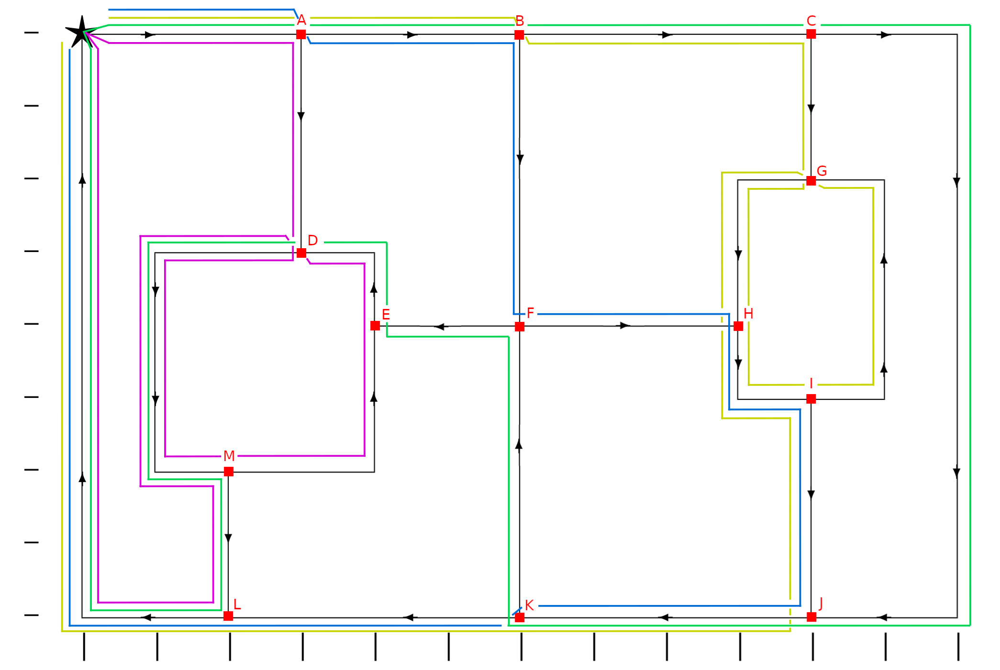

# Chinese Postman Problem with Linear Programming
A derivative of the Traveling Salesman Problem solved using linear programming

<h1 align="center">
  
</h1>

## Authors
* [João Teixeira](https://github.com/jtexeira)
* [José Filipe de Sousa Matos Ferreira](https://github.com/JoseFilipeFerreira)
* [Miguel André da Silva Solino](https://github.com/Manilator)
